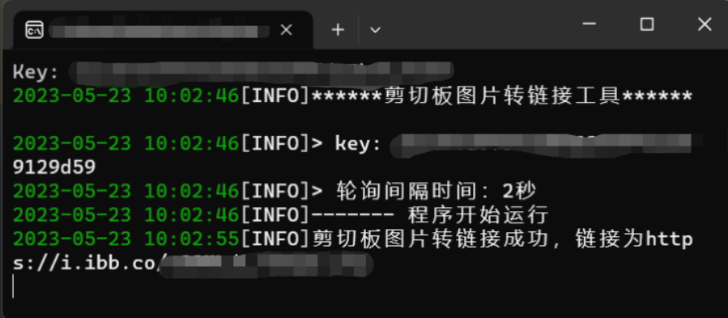

# 剪切板图片转链接工具

这是一个Python编写的剪切板图片转链接工具，它可以将剪切板中的图片转换为链接，并将转换后的链接设置回剪切板中。
适用于无法粘贴图片的情况，可使用该工具将剪切板截图转换为链接进行文本输入。



## 使用方法
### 依赖安装

在使用本工具之前，请确保已经安装以下依赖包：
- click
- pyperclip
- Pillow
- loguru
- requests

在命令行可以通过以下命令安装：
```shell
pip install -r requirements.txt
```

### 运行程序

在命令行运行以下命令启动程序：
```shell
python imageSwitch.py
```

### 参数设置

程序支持两个参数：
- --key / -k：key为从图像共享网站 'https://imgbb.com' 申请的API key，必选参数。
- --delay / -d：轮询间隔时间，单位为秒，默认为 2 秒，非必选参数。

例如，下面的命令将轮询间隔时间设为 3 秒：
```shell
python imageSwitch.py --key 你的API-key --delay 3
```

## 转换结果

程序将剪切板中的图片转换为链接，并将转换后的链接设置回剪切板中。链接可以通过直接粘贴或者通过其他支持的方式进行使用。

## 打包成可执行程序

如果你想将该 Python 程序打包成 Windows 可执行文件，可以使用 PyInstaller 工具进行打包。
打包后的程序可以在 Windows 上运行，而无需安装 Python 环境。

1. 安装 pyinstaller 工具

在命令行中运行以下命令安装 pyinstaller 工具：
```shell
pip install pyinstaller
```
2. 执行打包命令

在命令行中进入程序所在的文件夹，执行以下命令：
```shell
pyinstaller -F imageSwitch.py
```
其中，-F 表示打包成单个可执行文件，imageSwitch.py 是程序入口文件名。

3. 查找可执行文件

打包完成后，在生成的 dist 文件夹中可以找到可执行文件，其文件名与程序入口文件名相同，可双击打开该程序。

## 注意事项
- 该程序只能转换剪切板中的图片，无法转换文件或其他格式的图片。
- 由于转换图片会消耗一定的系统资源，建议适当增加轮询间隔时间，避免程序运行占用过多系统资源。
- 如果需要退出程序，可以按Ctrl+C组合键。

## 支持

如果该项目对你有帮助请在GitHub上Star或将该项目分享。

